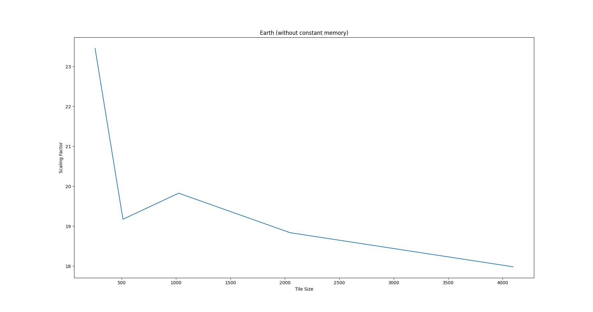
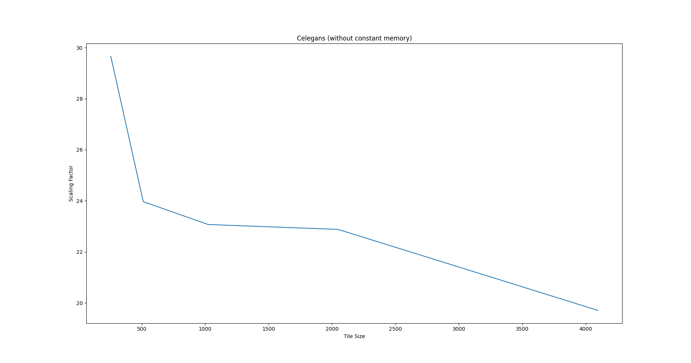
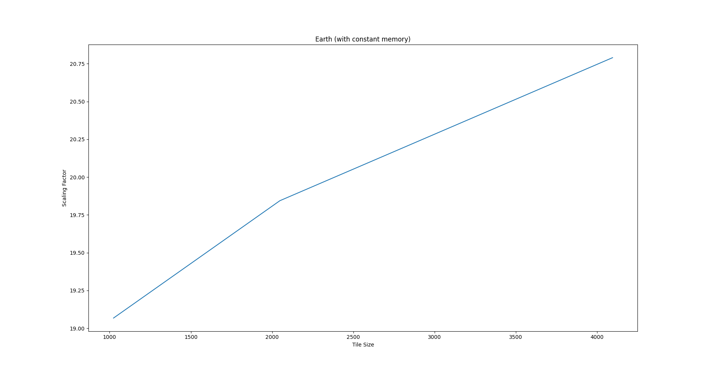
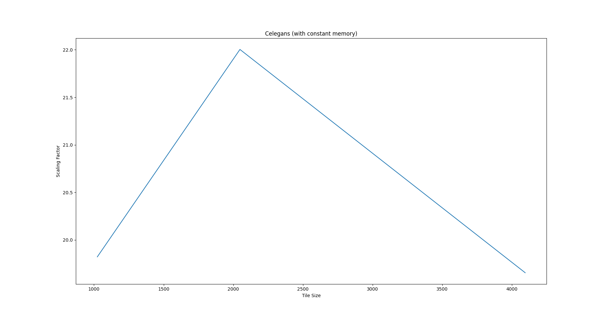

# Assignment 1

| Roll No. |         Name         |
| :------: | :------------------: |
| 2018007  | Aditya Singh Rathore |

## Question 1

> Write a CUDA version of the AHE computation. Use global memory for storing all images and arrays. 

The process is divided into three kernels:

* `ahe_get_PDF` : Computes the PDF for given image.
* `ahe_get_mappings` : Computes the mappings array
* `ahe_equalize` : Interpolation of each pixel using mappings from neighbourhood pixels.

### `ahe_get_pdf`

Goal is to compute frequency distribution of grey level values for each tile. 

#### Kernel Launch

* We create a global array $pdf$ of size $num\_tiles * 256$.
  * $256$ levels ($=pdf$) for each tiles.
* Initialise all $pdf$s to $0$.
* We will allocate a thread for each pixel.
* We will create a $2D$ grid with block dimension as $dim3(32, 32, 1)$
* Grid would have dimension as $dim3(width /32, height/32, 1)$  
  * $width$ and $height$ are image parameters.

#### Kernel

* We have allocated a thread for each pixel.
* Find $pdf$ corresponding to that pixel. 
* Find grey value of that pixel.
* Use `atomicAdd` to update the count of that gray level in $pdf$.

### `ahe_get_mappings`

#### Kernel Launch

* Corresponding to each tile, we have a $pdf$ of size $256$.
* We have an array like this:
  * <-----$pdf_1$-----><-----$pdf_2$-----><-----$pdf_3$----->......<-----$pdf_{n-1}$-----><-----$pdf_n$----->
  * $n$ is the number of tiles.
* The Kernel to create mappings will be launched such that each block processes one $pdf$.
* Number of blocks = Number of tiles
* Block size = $256$ threads.

#### Kernel 

* We create a copy of $pdf_n$ array of a block in a `shared memory`.
* We need to calculate cumulative frequency distribution of each $pdf$.
* $cdf_i$ = $\sum_{j=0}^{i}pdf_n[j]$
* $cdf_{min}$ will be the first non-zero $pdf$.
* Once we have these two values, we compute mappings (as in CPU code).

### `ahe_equalize`

#### Kernel Launch

* We will allocate a thread for each pixel.
* We will create a $2D$ grid with block dimension as $dim3(32, 32, 1)$
* Grid would have dimension as $dim3(width /32, height/32, 1)$  
  * $width$ and $height$ are image parameters.

#### Kernel

* This code is same as CPU. 
*  We Interpolate each pixel using mappings from neighbourhood pixels.

## Question 2

* After computing mappings array, we store those mappings in a `__const__` array.
  * `cudaMemcpyToSymbol(Mappings, d_mappings, mapping_size_bytes, 0, cudaMemcpyDeviceToDevice)`

## Question 3

>Submit a report with the following (all parts below are mandatory):
>
>* Document your approach to the problem in both case (1) and (2) above.  
>* Add output images 
>* Vary  the  TILE_SIZE  (both  in  X  and  Y  together)  to  be  (256,  512,  1024,  2048,  and 
>  4096) and present speedup analysis:
>  * Report CPU vs GPU timing results for both images in tabular format. Discuss if 
>    using constant memory improved performance of your code or not.  
>  * Plot the graph for speedup S

* Using `__const__` memory **did not have** any visible impact.

## Results

#### GPU Specs

* `Nvidia 1050 Ti`

### CPU vs GPU Timings

#### Without using constant for storing map

##### Earth

| Tile Size | CPU Time  | GPU Time  | RMS Error     | Mean absolute error | Scaling Factor       |
| --------- | --------- | --------- | ------------- | ------------------- | -------------------- |
| $256$     | $1551.11$ | $66.134$  | $0.975656$    | $0.030522$          | $23.45404784225965$  |
| $512$     | $1559.94$ | $81.3633$ | $0.00029901$  | $8.9407e-08$        | $19.17252618809709$  |
| $1024$    | $1570.1$  | $79.1956$ | $0.000559396$ | $3.12924e-07$       | $19.825596371515587$ |
| $2048$    | $1555.13$ | $82.5652$ | $0.000622439$ | $3.8743e-07$        | $18.83517511009481$  |
| $4096$    | $1580.31$ | $87.8854$ | $0.00059802$  | $3.57628e-07$       | $17.981525899696422$ |

##### Celegans

| Tile Size | CPU Time  | GPU Time  | RMS Error     | Mean absolute error | Scaling Factor       |
| --------- | --------- | --------- | ------------- | ------------------- | -------------------- |
| $256$     | $1574.46$ | $53.0821$ | $0$           | $0$                 | $29.66084612326943$  |
| $512$     | $1590.16$ | $66.3517$ | $0.000545915$ | $2.98023e-07$       | $23.96562559813841$  |
| $1024$    | $1558.16$ | $67.5414$ | $0.000888685$ | $7.89762e-07$       | $23.06970243435878$  |
| $2048$    | $1556.23$ | $68.022$  | $0.00092966$  | $8.64267e-07$       | $22.878333480344594$ |
| $4096$    | $1564.28$ | $79.3798$ | $0.000679659$ | $4.61936e-07$       | $19.706272880506123$ |

#### With using constant for storing map

Error => `ptxas error   : File uses too much global constant data (0x10014 bytes, 0x10000 max)`

##### Earth

| Tile Size | CPU Time  | GPU Time  | RMS Error     | Mean absolute error | Scaling Factor       |
| --------- | --------- | --------- | ------------- | ------------------- | -------------------- |
| $256$     | Error     | Error     | Error         | Error               | NA                   |
| $512$     | Error     | Error     | Error         | Error               | NA                   |
| $1024$    | $1595.24$ | $83.6617$ | $0.000559396$ | $3.12924e-07$       | $19.067745455805944$ |
| $2048$    | $1542.76$ | $77.7452$ | $0.000622439$ | $3.8743e-07$        | $19.843797430580924$ |
| $4096$    | $1552.17$ | $74.6601$ | $0.00059802$  | $3.57628e-07$       | $20.78981946180088$  |

##### Celegans

| Tile Size | CPU Time  | GPU Time  | RMS Error     | Mean absolute error | Scaling Factor       |
| --------- | --------- | --------- | ------------- | ------------------- | -------------------- |
| $256$     | Error     | Error     | Error         | Error               | NA                   |
| $512$     | Error     | Error     | Error         | Error               | NA                   |
| $1024$    | $1538.28$ | $77.6026$ | $0.000888685$ | $7.89762e-07$       | $19.822531719298066$ |
| $2048$    | $1544.49$ | $70.1931$ | $0.00092966$  | $8.64267e-07$       | $22.00344478303423$  |
| $4096$    | $1559.29$ | $79.331$  | $0.000679659$ | $4.61936e-07$       | $19.655494069153292$ |

## Output Images

NOTE: Outputs were very large and not getting rendered to pdf. Outputs are taling lots of space. It is requested to please generate for evaluating.
