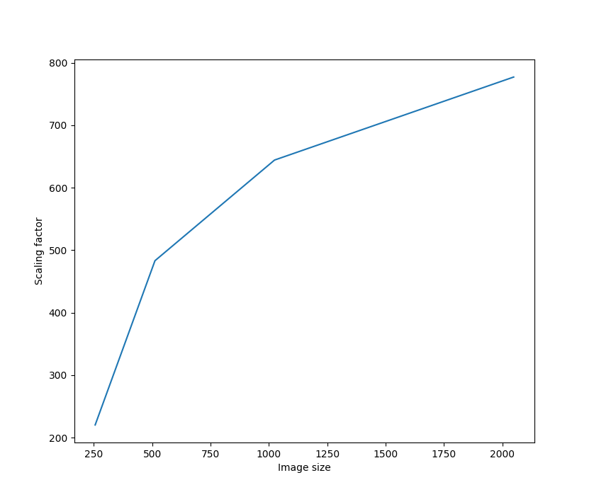
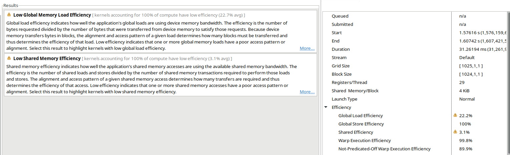
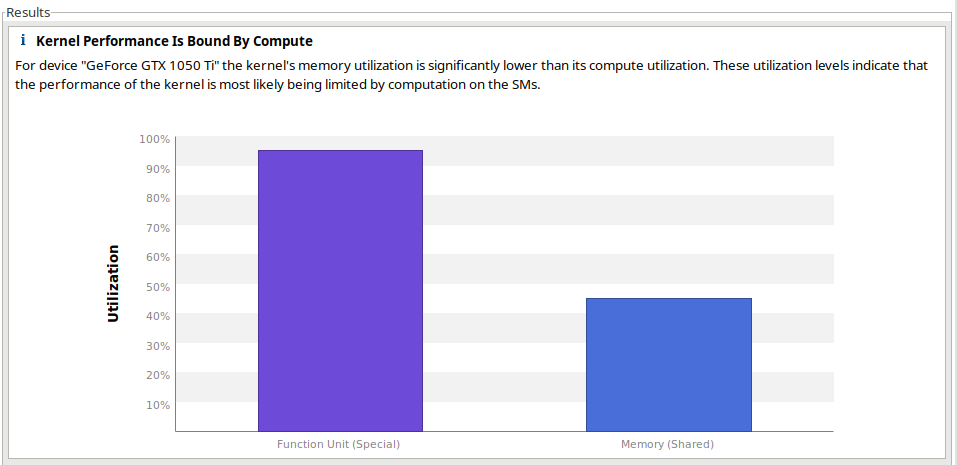
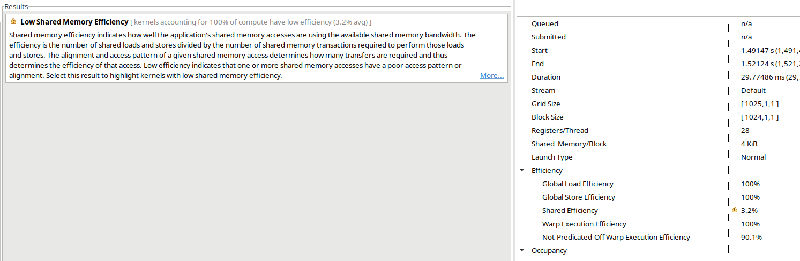
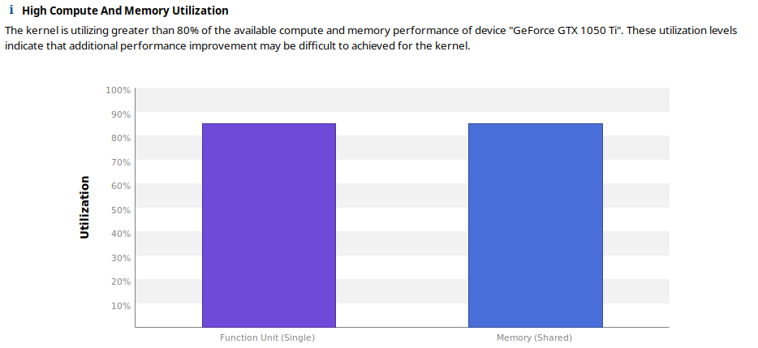
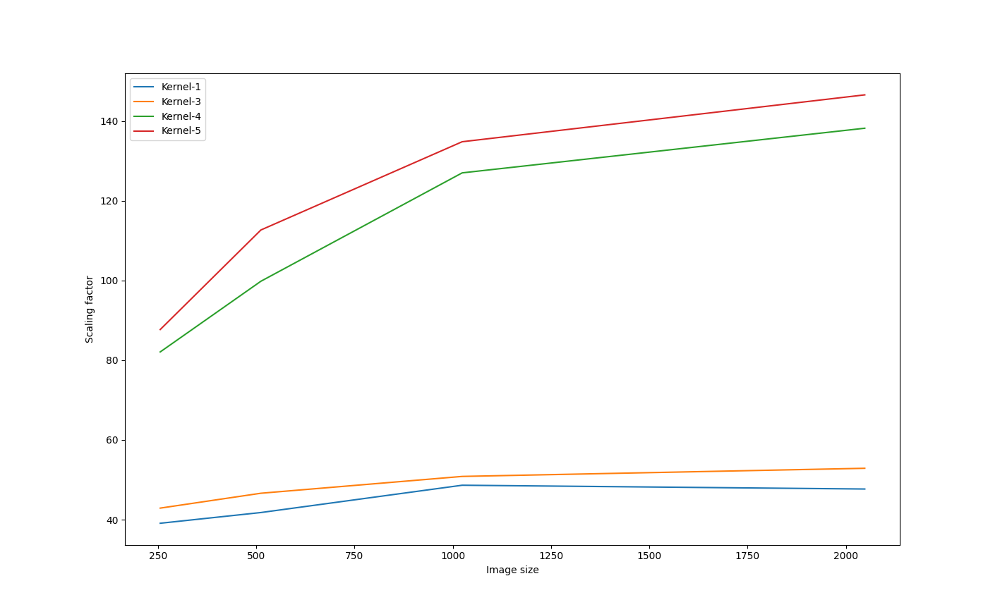

# Assignment-2

| Roll No |         Name         |
| :-----: | :------------------: |
| 2018007 | Aditya Singh Rathore |


## Part 1 (SDT computation on GPU )

> (a) Write a CUDA version of the SDT computation using shared memory.
> (b) Document your approach to the problem. 
> (c) Perform computations on CPU and GPU with image of sizes (256, 512, 1024, and 
> 2048).  Tabulate  CPU  and  GPU  (kernel  and  overall)  timing  results,  plot  speedups 
> (kernel and overall),  and report the`MSE` error in each case.

**Note** : Most optimised approach explained here. [Appendix, Kernel 5]

* The idea is compute minimum distances of each pixel from edge in one kernel and compute SDT from those minimum distances in second kernel.

* The number of edge pixels is calculated on the GPU.

  * Rather than atomic add to global variable for each thread, we have a block level variable and all threads add count atomically to that variable. 
  * Once it has counted edge pixels in the given block, we can add the block level count to global count (once per block). 

* Edge pixels are computed on the CPU. We cannot have multiple pixels elements writing to edge array, using atomic ops its a serial operation.

* Once we calculate minimum distance for each pixel, SDT calculation is straight forward.

* For computing minimum distance, we have to do the following:

  * ```python
    for pixel in image:
    	d_min = inf
    	a, b = pixel coordinates
        for edge in edges:
    		x, y  = edge coordinates
            d = (a-x)^2 + (b-y)^2
            d_min = min(d_min, d)
        min_dist[pixel] = d_min
    ```

* If we see calculating d, we can expand it further as:

  * ```
    d = (a-x)^2 + (b-y)^2
    d = a^2 + b^2 + x^2 + y^2 -2*(ax + by)
    ```

* We are computing a lot of those terms again and again. We can pre-compute them once and use them again as follows

  * ```python
    struct edge{
    	x, y, sqr
    }
    Edges = struct edge[number of edges]
    for edge in edges:
        x, y = edge coordinates
        Edges[edge].x = x
        Edges[edge].y = y
        Edges[edge].sqr = x^2 + y^2
    
    for pixel in image:
    	d_min = inf
    	a, b = pixel coordinates
        sqr = a^2 + b^2
        for edge in Edges:
            d = sqr + edge.sqr - 2*(a*edge.x + b*edge.y)
            d_min = min(d_min, d)
        min_dist[pixel] = d_min
    ```

* We can see that each pixel will access each edge. We can store edges in shared memory for faster access. 

* But, size of edges can be very large. So we will divide the edges into chunks of 1024 and call the kernel again and again with each chunk to get the global minimum distance. (see optimization why 1024)

  * ```python
    Edges = | c1 | c2 | c3 | ...| cn-1 |cn |
    sz_edge = len(Edges)
    size of c1 ... cn-1 = 1024
    size of cn = sz_edge % 1024
    ```

  * Calculating minimum distance for each pixel using chunks

    ```python
    __global__ void compute_dist(float* min_dist, struct Edge* global_edges,int start)
    {
    	extern __shared__ struct Edge edges[];
    	int i = threadIdx.x + blockIdx.x*blockDim.x;
    	edges[threadIdx.x] = global_edges[start + threadIdx.x];	
    	__syncthreads();
    	if (i >= Sz[0]) return;
    	int x = i%Width[0];
    	int y = i/Width[0];
    	float sqr = x*x + y*y;
    	float min = min_dist[i];
    	float dist2;
    	for(int k = 0; k < blockDim.x; k++){
    		dist2 =  edges[k].sqr + sqr -2*(x*edges[k].x + y*edges[k].y);
    		if(dist2 < min) min = dist2;
    	}
    	min_dist[i] = min;
    }
    ```


### Results

| Image Size | CPU time(Inter i7 8th generation, 16 GB Ram) | GPU time (IIITD server, NVIDIA1080) [Kernel-5] | Speed up | MSE  |
| ---------- | -------------------------------------------- | ---------------------------------------------- | -------- | ---- |
| 256        | 275.818 ms                                   | 1.25133 ms                                     | 220.419  | 0    |
| 512        | 4474.67 ms                                   | 9.26115 ms                                     | 483.16   | 0    |
| 1024       | 71157 ms                                     | 110.456 ms                                     | 644.2    | 0    |
| 2048       | 757062 ms                                    | 974.297 ms                                     | 777.03   | 0    |

* Scaling Factor



## Part 2

> How  will  you  modify  your  approach  to  use  constant  memory  instead  of  shared 
> memory? Explain why using constant memory instead of shared memory is a good/bad 
> choice in this case.

**Note** : Done for the most optimised approach. [Appendix, Kernel 5]

* We can store the computed edges in constant memory.
* But the constant memory is limited, we cannot do it for all images. Therefore it is a bad choice to use constant memory in this case.
* I was able to compute for image size `256x256` where number of edges was 2881.
  * I fixed number of edges beforehand.
* Instead of writing to constant memory, we can simply read from constant memory.
* For `256x256` image on`NVIDIA GTX 1050 Ti`, constant memory did not improve the performance.
  * Shared memory : 3.15299 ms
  * Constant memory : 3.45699 ms


## Part 3 (Kernel Analysis)

> (a) Analyze your CUDA kernel in terms of efficiency using `nvprof`/`nvvp` tool. 
> (b) Identify bottlenecks in your kernel.

* The main bottleneck is the computation of minimum distance for each pixel. 
* I went through 5 different kernels [see Appendix]. Here are the bottlenecks identified in each kernel.


### Kernel-1

* This was the most basic. 
* Each pixel iterates over each thread to calculate minimum distance. All of this is fetched from the global memory. 
* We can store edges in shared memory of each block. 
* Didn't need a profiler to see this. 
* Timings for this Kernel (NVIDIA GTX 1050 Ti)

| Size | CPU Time | GPU Time | Speedup | MSE  |
| ---- | -------- | -------- | ------- | ---- |
| 256  | 275.818 ms | 7.05322 | 39.10 | 0    |
| 512  | 4474.67 ms | 107.066 ms | 41.79 | 0    |
| 1024 | 71157 ms | 1462.88 ms | 48.64 | 0    |
| 2048 | 757062 ms | 15873.7 ms | 47.69 | 0    |


### Kernel-2

* Read Appendix for idea
* Generated by improving Kernel-1
* Using profiler, I was able to identify that global load efficiency and shared memory efficiency were poor.




#### Problem

* There problem was that single thread was copying memory to shared memory [Appendix]

  * ```c++
    __global__ void compute_dist(float* min_dist, int* global_edges, int height, int width, int start, int chunk_size)
    {
    	...
    	if(threadIdx.x == 0){
    		//Leader thread will write chunk to memory
    		for(int j = 0; j < chunk_size; j++){
    			edges[j] = global_edges[j+start]; 
    		}
    	}
    	__syncthreads();
    ```

* The timings for this kernel (NVIDIA GTX 1050 Ti)

| Size | CPU Time | GPU Time | Speedup | MSE  |
| ---- | -------- | -------- | ------- | ---- |
| 256  | 275.818 ms | 6.42819 | 42.90 | 0    |
| 512  | 4474.67 ms | 95.9526 | 46.63 | 0    |
| 1024 | 71157 ms | 1399.2 | 50.85 | 0    |
| 2048 | 757062 ms | 14311.8 | 52.89 | 0    |


### Kernel-3

* Generated by improving Kernel-2
* See Appendix for Kernel

* Using profiler we identified computations as bottleneck




#### Problem

* For computing minimum distance, we have to do the following:

  * ```python
    for pixel in image:
    	d_min = inf
    	a, b = pixel coordinates
        for edge in edges:
    		x, y  = edge coordinates
            d = (a-x)^2 + (b-y)^2
            d_min = min(d_min, d)
        min_dist[pixel] = d_min
    ```

* If we see calculating d, we can expand it further as:

  * ```
    d = (a-x)^2 + (b-y)^2
    d = a^2 + b^2 + x^2 + y^2 -2*(ax + by)
    ```

* We can compute `x^2 + y^2` for each edge once. 

* We can compute `a^2 + b^2` for each pixel outside loop once. 


### Kernel-4

* Created by optimising Kernel-3

#### Problems

* We are still calculating x, y and x^2^ + y^2^ in each block for each edge.

  ```c++
  __global__ void compute_dist(float* min_dist, int* global_edges,int start)
  {
  	extern __shared__ int edges[];
  	int i = threadIdx.x + blockIdx.x*blockDim.x;
  	int edge = global_edges[threadIdx.x+start];
  	int _x = edge % Width[0];
  	int _y = edge / Width[0];
  	edges[3*threadIdx.x] = _x;
  	edges[3*threadIdx.x+1] = _y;
  	edges[3*threadIdx.x+2] = _x*_x + _y*_y;
  	__syncthreads();
  ```

* Timings for this kernel (NVIDIA GTX 1050 Ti)
| Size | CPU Time | GPU Time | Speedup | MSE  |
| ---- | -------- | -------- | ------- | ---- |
| 256  | 275.818 ms | 3.36058 | 82.08 | 0    |
| 512  | 4474.67 ms | 44.8349 | 99.81 | 0    |
| 1024 | 71157 ms | 560.283  | 127 | 0    |
| 2048 | 757062 ms | 5474.75 | 138.2 | 0    |


### Kernel-5

* Created by Optimising Kernel-4
* See Appendix
* Timings for this Kernel [NVIDIA GTX 1050 Ti]

| Size | CPU Time | GPU Time | Speedup | MSE  |
| ---- | -------- | -------- | ------- | ---- |
| 256  | 275.818 ms | 3.14413 ms | 87.7 | 0    |
| 512  | 4474.67 ms | 39.7117 ms | 112.67 | 0    |
| 1024 | 71157 ms | 527.827 ms | 134.81 | 0    |
| 2048 | 757062 ms | 5165.55 ms | 146.57 | 0    |

### Problems

* Kernel Calls could be paralleled.
* Shared Memory efficiency is still not 100%


## Part 4 (Kernel Optimization)

> (a) Rewrite  a  better  version  of  your  kernel  based  on  your  analysis  (for  example: 
> improve  occupancy,  math  performance,  register/shmem  usage,  bank  conflicts, 
> coalescing, etc.).
> (b) Document  your  optimization  strategies.  Compare  and  plot  new  speedups  (kernel 
> and overall).

### Kernel-1 -> Kernel-2

* Compute minimum distance for each pixel in different kernel.
* Compute `sdt` for each pixel in a different Kernel .
* For computing minimum distance, we will store the edges in shared memory because each pixel reads all edges, each block can store in shared memory which will be faster.
* We cannot store entire edge array in shared memory as it gets very large, so we will divide it into chunks, say 25 and call the kernel multiple times.  
* For each pixel, we will initialise minimum distance to `FLT_MAX`.
* We will find the minimum distance with each chunk, first with chunk-1. Then with chunk-2 and so on. This way we will have the global minimum distance. 


### Kernel-2 -> Kernel-3

* The problem was low global load efficiency because a single thread was copying from global memory to shared memory. 
* We fixed the chunk size = block size = 1024.
* Each thread in block copies from global memory to local memory

```c++
__global__ void compute_dist(float* min_dist, int* global_edges,int start)
{
	extern __shared__ int edges[];
	int i = threadIdx.x + blockIdx.x*blockDim.x;

	edges[threadIdx.x] = global_edges[threadIdx.x+start];
	__syncthreads();
	...	
}
```



* Global load efficiency is 100%

### Kernel-3 -> Kernel-4

* Kernel is computation intensive.
* Simplified calculation by calculating edge variables once per block and pixel variable once

```c++
__global__ void compute_dist(float* min_dist, int* global_edges,int start)
{
	...
    // Once per block
	int edge = global_edges[threadIdx.x+start];
	int _x = edge % Width[0];
	int _y = edge / Width[0];
	edges[3*threadIdx.x] = _x;
	edges[3*threadIdx.x+1] = _y;
	edges[3*threadIdx.x+2] = _x*_x + _y*_y;
	
    ...
    //Once per pixel
	int x = i%Width[0];
	int y = i/Width[0];
	float sqr = x*x + y*y;
	...
	for(int k = 0; k < blockDim.x; k++){
		dist2 =  edges[3*k+2] + sqr -2*(x*edges[3*k] + y*edges[3*k+1]);
		if(dist2 < min) min = dist2;
	}
	...
}
```




### Kernel-4 -> Kernel-5

* Added Kernel to do edge computations only once/


### Results 

* On NVIDIA GTX 1050 Ti

| Size | Kernel-1 | Kernel-3 | Kernel-4 | Kernel-5 |
| :------: | :------: | :------: | :------: | :------: |
| 256 | 7.05322 | 6.42819 | 3.36058 | 3.14413 |
| 512 | 107.066 | 95.9526 | 44.8349 | 39.7117 |
| 1024 | 1462.88 | 1399.2 | 560.283 | 527.827 |
| 2048 | 15873.7 | 14311.8 | 5474.75 | 5165.55 |

* Scaling Factor comparison




## Appendix

### Kernel-1

* Compute Edges on the CPU.

* All Computations in one kernel. 
* Each thread will compute SDT for each pixel.

```c++
__global__ void compute_sdt(float* sdt, unsigned char* bitmap, int* edges, int height, int width, int edge_size)
{
	int x = threadIdx.x + blockIdx.x*blockDim.x;
	int y = threadIdx.y + blockIdx.y*blockDim.y;
	if ( x < width && y < height){
		float min_dist = FLT_MAX;
		for(int k=0; k<edge_size; k++)
		{
			float _x = edges[k] % width;
			float _y = edges[k] / width;
			float dx = _x - x;
			float dy = _y - y;
			float dist2 = dx*dx + dy*dy;
			if(dist2 < min_dist) min_dist = dist2;
      }
      float sign  = (bitmap[x + y*width] >= 127)? 1.0f : -1.0f;
      sdt[x + y*width] = sign * sqrtf(min_dist);
	}
}
```

### Kernel-2

* Compute minimum distance for each pixel in different kernel.
* Compute `sdt` for each pixel in a different Kernel .
* For computing minimum distance, we will store the edges in shared memory because each pixel reads all edges, each block can store in shared memory which will be faster.
* We cannot store entire edge array in shared memory as it gets very large, so we will divide it into chunks, say 25 and call the kernel multiple times.  
* For each pixel, we will initialise minimum distance to `FLT_MAX`.
* We will find the minimum distance with each chunk, first with chunk-1. Then with chunk-2 and so on. This way we will have the global minimum distance. 

#### Kernel

```c++
__global__ void compute_dist(float* min_dist, int* global_edges, int height, int width, int start, int chunk_size)
{
	extern __shared__ int edges[];
	int i = threadIdx.x + blockIdx.x*blockDim.x;
	if(threadIdx.x == 0){
		//Leader thread will write chunk to memory
		for(int j = 0; j < chunk_size; j++){
			edges[j] = global_edges[j+start]; 
		}
	}
	__syncthreads();
	if (i >= height*width) return;

	int x = i%width;
	int y = i/width;
	float min = min_dist[i];
	float _x, _y, dx, dy, dist2;
	for(int k = 0; k < chunk_size; k++){
		_x = edges[k] % width;
		_y = edges[k] / width;
		dx = _x - x;
		dy = _y - y;
		dist2 = dx*dx + dy*dy;
		if(dist2 < min) min = dist2;
	}
	min_dist[i] = min;
}

__global__ void compute_sdt(unsigned char* bitmap, float* min_dist, float* sdt, int sz){
	int i = threadIdx.x + blockDim.x*blockIdx.x;
	if(i >= sz) return;
	float sign  = (bitmap[i] >= 127)? 1.0f : -1.0f;
    sdt[i] = sign * sqrtf(min_dist[i]);
}
```

#### Calling 

```c++
const auto num_chunks = 25;
const auto chunk_size = sz_edge/num_chunks;
const auto last_chunk = sz_edge%num_chunks;
const auto block_size = 256;	
const auto grid_size = (sz/block_size) + 1; 
for(int i = 0; i < num_chunks; i++){
	compute_dist<<< grid_size, block_size, chunk_size*sizeof(int)>>>(d_min_dist.arr(), 
	d_edges.arr(), 
	height, width,
    i*chunk_size, 
    chunk_size);
}
if (last_chunk != 0){
	compute_dist<<< grid_size, block_size, last_chunk*sizeof(int)>>>(d_min_dist.arr(),
		d_edges.arr(),
		height, width,
		num_chunks*chunk_size, last_chunk);
}
```

### Kernel-3

* Same as Kernel-2. 
* Global load store efficiency is improved. 
* Edges is divided into equal sized chunks of size 1024.
* Instead of first thread in block writing to shared memory, all threads write to shared memory (chunk size = block size).

#### Kernel

```c++
__global__ void compute_dist(float* min_dist, int* global_edges,int start)
{
	extern __shared__ int edges[];
	int i = threadIdx.x + blockIdx.x*blockDim.x;

	edges[threadIdx.x] = global_edges[threadIdx.x+start];
	__syncthreads();

	int sz = Sz[0];
	if (i >= sz) return;
	
	int width = Width[0];
	
	int x = i%width;
	int y = i/width;
	float min = min_dist[i];
	float _x, _y, dx, dy, dist2;
	for(int k = 0; k < blockDim.x; k++){
		int edge = edges[k];
		_x = edge % width;
		_y = edge / width;
		dx = _x - x;
		dy = _y - y;
		dist2 = dx*dx + dy*dy;
		if(dist2 < min) min = dist2;
	}
	min_dist[i] = min;
}
```

#### Launch

````c++
const auto chunk_size = 1024;
const auto num_chunks = sz_edge/chunk_size;
const auto last_chunk = sz_edge%chunk_size;
	
const auto block_size = chunk_size;
const auto grid_size = (sz/block_size) + 1;
const auto grid_last_chunk = (sz/last_chunk) + 1;
for(int i = 0; i < num_chunks; i++){
	compute_dist<<< grid_size, block_size, chunk_size*sizeof(int)>>>(d_min_dist.arr(), 
	d_edges.arr(), 
	i*chunk_size);
}
if (last_chunk != 0){
	compute_dist<<< grid_last_chunk, last_chunk, last_chunk*sizeof(int)>>>(d_min_dist.arr(),
		d_edges.arr(),
		num_chunks*chunk_size);
}
````

### Kernel-4

* When computing `dist2`, each thread will be computing some computations that can be done only once at block level (explained in Kernel Optimization).

#### Kernel

```c++
__global__ void compute_dist(float* min_dist, int* global_edges,int start)
{
	extern __shared__ int edges[];
	int i = threadIdx.x + blockIdx.x*blockDim.x;
	int edge = global_edges[threadIdx.x+start];
	int _x = edge % Width[0];
	int _y = edge / Width[0];
	edges[3*threadIdx.x] = _x;
	edges[3*threadIdx.x+1] = _y;
	edges[3*threadIdx.x+2] = _x*_x + _y*_y;
	__syncthreads();

	int sz = Sz[0];
	if (i >= sz) return;
	
	int x = i%Width[0];
	int y = i/Width[0];
	float sqr = x*x + y*y;
	float min = min_dist[i];
	float dist2;
	for(int k = 0; k < blockDim.x; k++){
		dist2 =  edges[3*k+2] + sqr -2*(x*edges[3*k] + y*edges[3*k+1]);
		if(dist2 < min) min = dist2;
	}

	min_dist[i] = min;
}
```


### Kernel-5

* We can count number of edge pixels on the GPU.
* We are calculating `x`, `y` and `sqr` for each edge in every block. 
* We can still do better by computing them globally and creating an `array of structs` for each each edge.

#### Kernel

```c++
struct Edge{
	float x, y, sqr;
};
```

* Count the number of pixels.

```c++
__global__ void count_edge_pixels(unsigned char* bitmap, int* sz_edges){
	__shared__ int num_edges;
	int i = threadIdx.x + blockDim.x*blockIdx.x;
	if(i >= Sz[0]) return;

	if (threadIdx.x == 0){
		num_edges = 0;
	}
	__syncthreads();
	
	if (bitmap[i] == 255){
		atomicAdd(&num_edges, 1);
	}
	__syncthreads();
	if (threadIdx.x == 0){
		atomicAdd(sz_edges, num_edges);
	}
}
```

* Calculate x, y and sqr for each edge index calculated on the CPU.

```c++
__global__ void compute_edge_pixels(struct Edge* edges, int* edge_indices){
	int i = threadIdx.x + blockDim.x*blockIdx.x;
	if(i >= Sz_edges[0]) return;
	int edge = edge_indices[i];
	int _x = edge % Width[0];
	int _y = edge / Width[0];
	edges[i].x = _x;
	edges[i].y = _y;
	edges[i].sqr = _x*_x + _y*_y;
}
```

* We create shared memory of `struct Edge`

```c++
__global__ void compute_dist(float* min_dist, struct Edge* global_edges,int start)
{
	extern __shared__ struct Edge edges[];
	int i = threadIdx.x + blockIdx.x*blockDim.x;
	edges[threadIdx.x] = global_edges[start + threadIdx.x];	
	__syncthreads();
	if (i >= Sz[0]) return;
	int x = i%Width[0];
	int y = i/Width[0];
	float sqr = x*x + y*y;
	float min = min_dist[i];
	float dist2;
	for(int k = 0; k < blockDim.x; k++){
		dist2 =  edges[k].sqr + sqr -2*(x*edges[k].x + y*edges[k].y);
		if(dist2 < min) min = dist2;
	}
	min_dist[i] = min;
}
```

