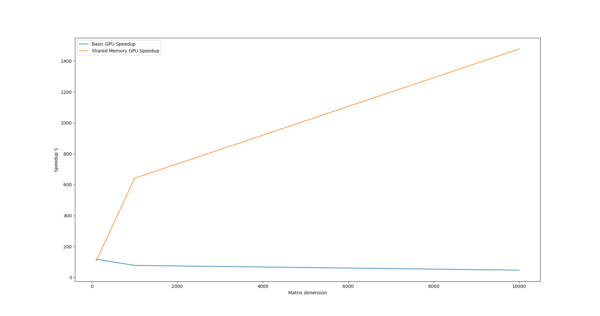

# Lab 3 : Shared Memory

## Results

### GPU Specs

* $\text{NVIDIA 1050 Ti}$

| Matrix Dimension     | CPU Time (ms) | Basic GPU (ms) | GPU with shared memory (ms) |
| -------------------- | ------------- | -------------- | --------------------------- |
| $10000 \times 10000$ | $9.16008e+06$ | $195027$       | $6199.7$                    |
| $1000 \times 1000$   | $4850.32$     | $62.3315$      | $7.55814$                   |
| $100 \times 100$     | $5.90179$     | $0.050176$     | $0.055296$                  |

| Matrix Dimension     | $S_1$ (Basic GPU Speedup) | $S_2$ (Shared Memory GPU Speedup) |
| -------------------- | ------------------------- | --------------------------------- |
| $10000 \times 10000$ | $46.96826593240936$       | $1477.5037501814604$              |
| $1000 \times 1000$   | $77.81490899464957$       | $641.7346066624857$               |
| $100 \times 100$     | $117.62177136479592$      | $106.7308666087963$               |

 

$$
S_1 = \frac{\text{time on CPU}}{\text{time on GPU basic implementation}}
$$

$$
S_2 = \frac{\text{time on CPU}}{\text{time on GPU shared memory implementation}}
$$

